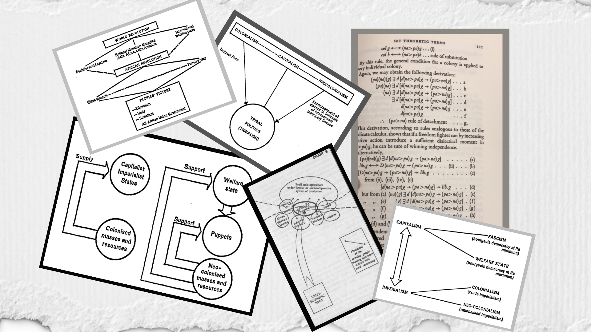

```{r setup, include=FALSE}
options(htmltools.dir.version = FALSE)
xaringanExtra::use_panelset()
```

```{r xaringan-themer, include=FALSE}
library(xaringanthemer)
mono_accent(
  base_color = "#d63737",
  text_font_family = "'Palatino Linotype'",
  title_slide_text_color = "#faf333")
#   white_color = lighten_color(base_color,0.9), 
#   black_color = darken_color(base_color, 0.3),
#   text_color = black_color, 
#   header_color = base_color,
#   background_color = white_color, 
#   link_color = base_color,
#   text_bold_color = base_color, 
#   text_slide_number_color = base_color,
#   padding = "1em 4em 1em 4em", 
#   background_image = NA,
#   background_size = NA, 
#   background_position = NA,
#   code_highlight_color = "rgba(255,255,0,0.5)",
#   code_inline_color = base_color, 
#   code_inline_background_color = NA,
#   code_inline_font_size = "1em", 
#   inverse_background_color = base_color,
#   inverse_text_color = white_color, 
#   inverse_text_shadow = FALSE,
#   inverse_header_color = white_color,
#   title_slide_text_color = inverse_text_color,
#   title_slide_background_color = inverse_background_color,
#   title_slide_background_image = NA, 
#   title_slide_background_size = NA,
#   title_slide_background_position = NA, 
#   footnote_color = NA,
#   footnote_font_size = "0.9em", 
#   footnote_position_bottom = "3em",
#   left_column_subtle_color = apply_alpha(base_color, 0.6),
#   left_column_selected_color = base_color,
#   blockquote_left_border_color = apply_alpha(base_color, 0.5),
#   table_border_color = "#666", 
#   table_row_border_color = "#ddd",
#   table_row_even_background_color = lighten_color(base_color, 0.8),
#   text_font_size = "20px", 
#   header_h1_font_size = "55px",
#   header_h2_font_size = "45px", 
#   header_h3_font_size = "35px",
#   text_slide_number_font_size = "0.9em", 
#   text_font_google = NULL,
#   text_font_family = "'Palatino Linotype'", 
#   text_font_weight = "normal",
#   text_font_url = "https://fonts.googleapis.com/css?family=Droid+Serif:400,700,400italic",
#   text_font_family_fallback = "'Palatino Linotype', 'Book Antiqua', Palatino, 'Microsoft YaHei', 'Songti SC'",
#   text_font_base = "serif", 
#   header_font_google = NULL,
#   header_font_family = "'Yanone Kaffeesatz'", 
#   header_font_weight = "normal",
#   header_font_url = "https://fonts.googleapis.com/css?family=Yanone+Kaffeesatz",
#   code_font_google = NULL, 
#   code_font_family = "'Source Code Pro'",
#   code_font_size = "0.9em",
#   code_font_url = "https://fonts.googleapis.com/css?family=Source+Code+Pro:400,700",
#   code_font_family_fallback = "'Lucida Console', Monaco", 
#   extra_css = NULL,
#   extra_fonts = NULL, 
#   outfile = "xaringan-themer.css"
# )
```

# What is Historical Materialism?
--

> *"The Marxist theory of history that insists that history proceeds inevitably on a path from feudalism to communism owing to the development of the forces of production."*

.pull-right[
&#150; Tim Creswell in *Geographic Thought: A Critical Introduction*
]

--

<br>

> _"...a **methodology** used by **scientific socialists** to understand human societies and their development through history, arguing that historical changes in social structure are the result of material and technological conditions **rather than ideals.**"_

.pull-right[
&#150; "Historical Materialism", Wikipedia
]

---

# Origins and Associations


---

# Related Concepts

.panelset[
.panel[.panel-name[Dialectics]

The interaction between **contradictory forces** produces something new (e.g. thesis-antithesis-synthesis).

![:col_header Plato, Hegel, Marx]
![:col_list Socratic dialogues, Systematized idealism, "Turned Hegel on his head"]
<br>
![:col_list Exchange of ideas, "World Spirit" moves history, Material forces move history]

]
.panel[.panel-name[Idealism]

The emphasis on **ideas** as historical movers and shakers. For Historical Materialists, idealism obscures reality and is generally an error to be avoided.

For example, consider the American Revolution: was it motivated by sentiments of liberty, fraternity, and equality (idealism), or rather, an emerging young merchant class increasingly coming into conflict with the vestiges of feudal society (materialism)?  

Which explanation has more *explanatory power?* 
<br>
Which explanation *demystifies reality* in a more coherent fashion?

]

.panel[.panel-name[Relations to Production]

> _"The social arrangement of humans that is mobilized in order to produce things. These are the arrangements people have to enter into in order to produce and reproduce their means of life at a given point in history. Together with the productive forces they form the mode of production."_

.pull-right[
&#150; Tim Creswell in *Geographic Thought: A Critical Introduction*
]

<br>
<br>

![:col_header Communalism, Slavery, Feudalism, Capitalism]

]

.panel[.panel-name[Base and Superstructure]

> _"...the mode of production of material life conditions the social, political, and intellectual life..."_

.pull-right[
&#150; Karl Marx in *Preface to a Contribution to the Critique of Political Economy*
]

]

]

---

# A Science?


---

# Materialism ~ Geography

.panelset[
.panel[.panel-name[Those You'll Soon Meet]

.pull-left[
* David Harvey
* Henri Lefebvre
* J K Gibson-Graham
* Raymond Williams
]

.pull-right[
* Neil Smith
* Antonio Gramsci
* Piers Bliekie
* Harold Brookfield
]

]

.panel[.panel-name[AAG 2016]

At the 2016 AAG annual meeting in San Francisco, a panel session was organized: “Did We Accomplish the Revolution in Geographic Thought?”, in response to David Harvey's criticisms decades earlier.

> _"All materialism must be **historical materialism."**_

.pull-right[
&#150; Don Mitchell
]

> _"Beyond this violence, a **historical materialism** that most Marxists too readily dismiss..."_

.pull-right[
&#150; Simon Springer
]
]

.panel[.panel-name[Ruth Wilson Gilmore]

Ruth Wilson Gilmore is professor of Earth & Environmental Sciences, and American Studies at the City University of New York, and the director of the Center for Place, Culture, and Politics. She also serves on the Executive Committee of the Institute for Research on the African Diaspora in the Americas and the Caribbean.

> _"I became a geographer when I was in my 40s because it seemed to me, at least in the context of US graduate education, it was the best way to pursue serious materialist analysis."_   

* Co-founder of many grassroots organizations including the California Prison Moratorium Project, Critical Resistance, and the Central California Environmental Justice Network.
* Author of the prize-winning *Golden Gulag: Prisons, Surplus, Crisis, and Opposition in Globalizing California* (UC Press).

]

]

---

class: center, middle

### fin


