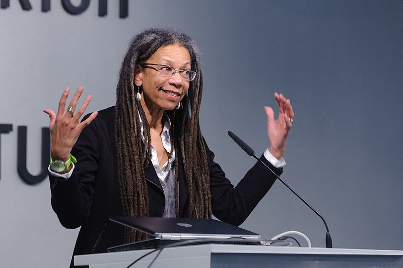

```{r setup, include=FALSE}
options(htmltools.dir.version = FALSE)
```

```{r xaringan-themer, include=FALSE, warning=FALSE}
library(xaringanthemer)
style_duo_accent(
  primary_color = "#1381B0",
  secondary_color = "#FF961C",
  inverse_header_color = "#FFFFFF"
)
xaringanExtra::use_panelset()
```

```{css echo=FALSE}
.center2 {
  margin: 0;
  position: absolute;
  top: 50%;
  left: 50%;
  -ms-transform: translate(-50%, -50%);
  transform: translate(-50%, -50%);
}

```

# Why I Chose RWG

.center2[
```{r echo = FALSE}

```
]

---

# Ruth Wilson Gilmore

.panelset[

.panel[.panel-name[Early Life]

* Born April 2, 1950 in New Haven, Connecticut
* Raised in a politically active family
* First (and only) African-American student at her private school

.center[

]
]

.panel[.panel-name[Education]
* Earned undergraduate degree in Drama
* A lifelong community organizer and educator
* Studied geography and economics under Neil Smith at Rutgers University, earning her Ph.D in 1998

> *"I became a geographer to engage with questions of how we make the world and ourselves, and to study how everyday people do so with the dream of justice, equality, and beauty for all."* 

<br>

> *""I became a geographer when I was in my 40s because it seemed to me, at least in the context of US graduate education, it was the best way to pursue serious materialist analysis."*

]

.panel[.panel-name[Current]

.pull-left[
* Professor of Geography at the City University of New York
* Director of the Center for Place, Culture, and Politics
* Executive Committee member of the Institute for Research on the African Diaspora in the Americas and the Caribbean
* Award-winning author, global speaker, and lifelong activist
]
.pull-right[

]
]

.panel[.panel-name[Methods]

> *"My methods are as diverse as my subjects: while ethnography, interviews, and community studies constitute the heart of my labors, I use archives and statistics for armature."*

.center[

]

]

.panel[.panel-name[Influence]

Co-founder of:
* California Prison Moratorium Project
* Critical Resistance
* Central California Environmental Justice Network

Winner of:
* American Studies Association Angela Y. Davis Award for Public Scholarship
* Association of American Geographers Harold Rose Award for Anti-Racist Research and Practice
* SUNY-Purchase College Eugene V. Grant Distinguished Scholar Prize for Social and Environmental Justice
* American Studies Association Richard A Yarborough Mentorship Award
* Association of American Geographers Lifetime Achievement Award
* Lannan Foundation Lifetime Cultural Freedom Prize
]
]

---

# Abolition

.center2[
```{r echo = FALSE}

```
]

---

# Abolition

.center2[
```{r echo = FALSE}

```
]

---

# Abolition and Geography

.center2[
```{r echo = FALSE}

```
]

---

# Abolition and Geography

.center2[
```{r echo = FALSE}

```
]

---

# Abolition and Humanism

.center2[
```{r echo = FALSE}
knitr::include_graphics("img/abolition-human-geography.png")
```
]
---

# Green, Red, Transnational

.center2[
```{r echo = FALSE}

```
]

---

# Abolition and Racial Capitalism

.center2[
```{r echo = FALSE}

```
]

---

class: middle, center

.center2[
```{r echo = FALSE}

```
]

